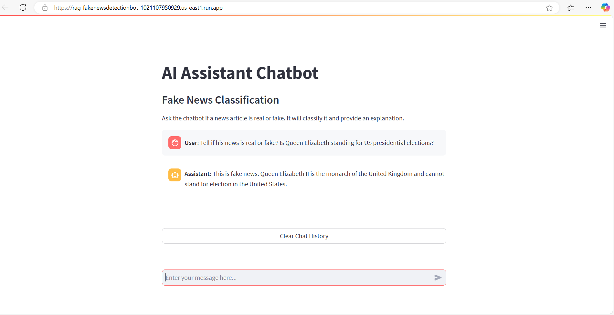
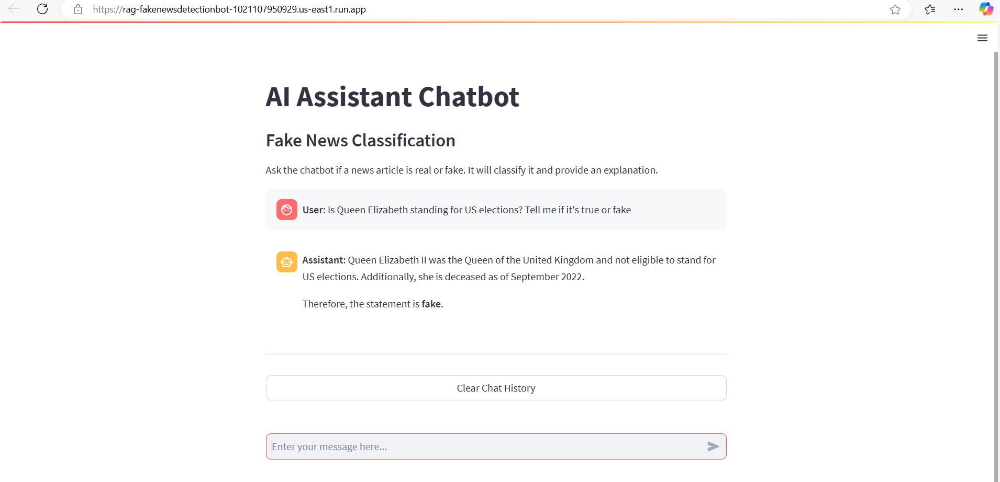

# 📰 Fake News Detection Chatbot

This project implements a **Fake News Detection Chatbot** using **Retrieval-Augmented Generation (RAG)** with **Google Cloud Platform (GCP)** services, **LangChain**, and **Streamlit** for the user interface.

## 🚀 Project Overview




### 🔹 1. Retrieval-Augmented Generation (RAG)
- **Vector Store:** Used **ChromaDB** as the vector database to store news embeddings.
- **Hosting:** Deployed on **Google Cloud Platform (GCP)** for scalability.
- **Retrieval:** Fetches relevant documents for context-aware classification.

### 🔹 2. LangChain Basics
- **Chunking:** Preprocesses large news articles into smaller chunks.
- **Embeddings:** Converts text into vector representations for similarity search.
- **Conversational Memory:** Retains context across user queries.

### 🔹 3. LLM: Gemini Pro
- **Model:** Utilized **Gemini Pro** for answering queries.
- **Classification & Explanation:** Determines if a news article is **real** or **fake** and provides reasoning.

### 🔹 4. Deployment: GCP Cloud Run
- **Cloud Run:** Used to deploy the chatbot backend for scalability.
- **CI/CD:** Automated deployment using **Google Cloud Build**.

### 🔹 5. UI: Streamlit Chatbot
- **Frontend:** Built using **Streamlit** for a simple and interactive chatbot interface.
- **User Input:** Allows users to input news articles or headlines for verification.

---

## 🛠️ Setup Instructions

### 🔧 1. Install Dependencies
```bash
pip install -r requirements.txt
```

### 🔹 2. Set Up Environment Variables
Create a `.env` file and add:
```ini
GCP_PROJECT_ID=your-gcp-project-id
GEMINI_API_KEY=your-api-key
CHROMA_DB_PATH=your-chroma-db-path
```

### 🔹 3. Run locally
```bash
streamlit run app.py
```

### 🔹 4. Deploy on Cloudrun
```bash
gcloud run deploy fakenews-chatbot `
  --source . `
  --platform managed `
  --region us-east1 `
  --allow-unauthenticated `
  --set-env-vars GOOGLE_ENTRYPOINT="python app.py" `
  --max-instances 2 `
  --min-instances 1
```
 

